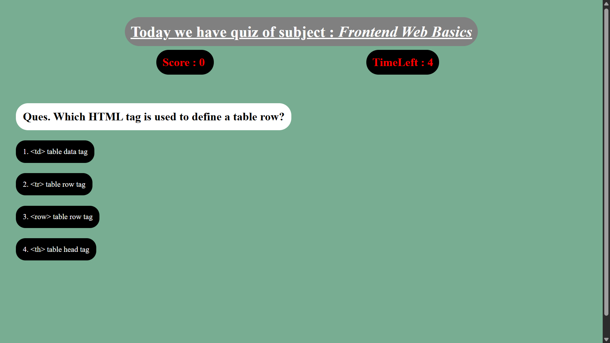

<h1 align="center">✨ ExamEngine – Quiz Web App ✨</h1>

  <b>HTML • CSS • Vanilla JavaScript</b> 
  A developer-focused quiz web application with timer, score tracking, and an interactive real-exam experience

  🔗 <b>Live Demo:</b>
  <a href="https://visheshgupta0404.github.io/ExamEngine/" target="_blank">
    Visit ExamEngine
  </a>

  

<h2 align="center">🎯 About the Project</h2>

  <b>ExamEngine</b> is a browser-based quiz application built to strengthen
  <b>JavaScript fundamentals</b>, <b>DOM manipulation</b>, and <b>real-world UI thinking</b>.
  It simulates an actual exam interface where users answer questions under time pressure and receive instant feedback.

  ✨ <b>Mission:</b> Build practical frontend projects 
  🔥 <b>Approach:</b> Learn → Build → Improve → Repeat

<h2 align="center">🚀 Features</h2>

<ul>
  <li>⏱️ Timer for each question</li>
  <li>📊 Real-time score tracking</li>
  <li>🎯 Correct answer highlighting</li>
  <li>🎨 Clean, creative and interactive UI</li>
  <li>✨ Smooth hover effects on all options</li>
  <li🧠 Developer-focused quiz flow</li>
  <li>📱 Responsive layout</li>
  <li>⚡ Built using pure Vanilla JavaScript</li>
  <li>🧩 Easy to extend with new questions and subjects</li>
</ul>

<h2 align="center">🛠️ Tech Stack</h2>

<ul>
  <li><b>HTML</b> – Structure of the app</li>
  <li><b>CSS</b> – Styling, layout, and UI effects</li>
  <li><b>JavaScript (Vanilla JS)</b> – Quiz logic, timer, score handling</li>
</ul>

<h2 align="center">📂 Project Structure</h2>

<pre>
ExamEngine/
│
├── index.html
├── style.css
├── script.js
├── WebPage.png
├── Sample Video.mp4
└── README.md
</pre>

<h2 align="center">▶️ How to Run Locally</h2>

<ol>
  <li>Clone the repository</li>
</ol>

<pre>
git clone https://github.com/visheshgupta0404/ExamEngine.git
</pre>

<ol start="2">
  <li>Navigate to the project folder</li>
  <li>Open <code>index.html</code> in any modern browser</li>
  <li>Start attempting the quiz 🎉</li>
</ol>

<h2 align="center">🌱 Learning Outcomes</h2>

<ul>
  <li>Handling dynamic UI using JavaScript</li>
  <li>Working with timers using <code>setInterval</code> and <code>setTimeout</code></li>
  <li>Building quiz logic and score systems</li>
  <li>DOM manipulation using Vanilla JS</li>
  <li>Designing real-world style interfaces</li>
</ul>

<h2 align="center">🔮 Future Improvements</h2>

<ul>
  <li>Add multiple quiz categories</li>
  <li>User authentication system</li>
  <li>Result summary page</li>
  <li>Leaderboard system</li>
  <li>Backend integration</li>
</ul>

<h2 align="center">👤 Author</h2>

  <b>Vishesh Gupta</b> 
  Frontend Development Enthusiast 
  🔗 <a href="https://github.com/visheshgupta0404" target="_blank">GitHub Profile</a>

<h2 align="center">⭐ Show Your Support</h2>

  If you like this project, consider giving it a ⭐ on GitHub — it really motivates me to build more real-world projects!

